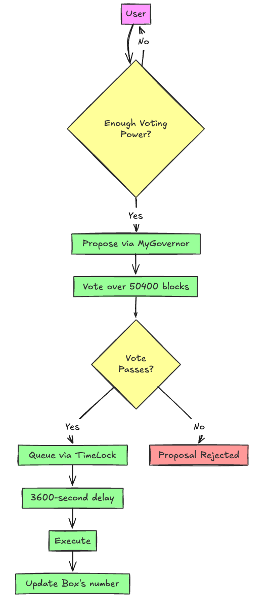

# DAO Governance Example

A minimal example demonstrating DAO governance using OpenZeppelin's Governor contract, Timelock Controller, and ERC20Votes token.



## Overview

This repository contains a basic DAO governance system implementation with:

- Governance token with voting power
- Governor contract for proposal management
- Timelock controller for secure transaction execution
- Example Box contract demonstrating governance-controlled state changes

## Features

- 🗳️ ERC20Votes governance token with delegation
- ⏳ Timelock-controlled contract upgrades
- 📜 Governance proposals lifecycle management (create, vote, execute)
- 🧪 Comprehensive test coverage of governance flow

## Prerequisites

- [Node.js](https://nodejs.org/) (v18+)
- [Foundry](https://getfoundry.sh/)
- [Git](https://git-scm.com/)

## Installation

1. Clone the repository:
   ```bash
   git clone https://github.com/your-username/dao-governance-example.git
   cd dao-governance-example
   ```

## Install dependencies:

```bash
forge install OpenZeppelin/openzeppelin-contracts --no-commit
```

## Usage

1. Deploy contracts

- Deploy Governance Token
- Deploy Timelock Controller
- Deploy Governor contract
- Deploy Box contract and transfer ownership to Timelock

2. Governance Flow:

- Proposal creation
  -Voting period
- Queue proposal in Timelock
- Execute proposal after delay

## Testing

Run the test suite with:

```bash
forge test -vvv
```

Test coverage includes:

- Basic governance proposal lifecycle
- Timelock security checks
- Voting power verification
- State change validations

## Project Structure

```bash
.
├── src/
│   ├── Box.sol              - Ownable contract with governance-protected state
│   ├── GovToken.sol         - Governance token with ERC20Votes extension
│   ├── TimeLock.sol         - Timelock controller for delayed execution
│   └── MyGovernor.sol       - Governor contract (to be implemented)
├── test/
│   └── MyGovernorTest.t.sol - Complete governance flow tests
└── img/                     - Architecture diagrams
```

## MyGovernor Contract (To Implement)

- The Governor contract should inherit from OpenZeppelin's Governor base contracts and implement:
- Voting delay/period configuration
- Quorum requirements
- Proposal threshold
- Vote counting logic

## Contributing

Contributions are welcome! Please open an issue first to discuss proposed changes.

## License

MIT
